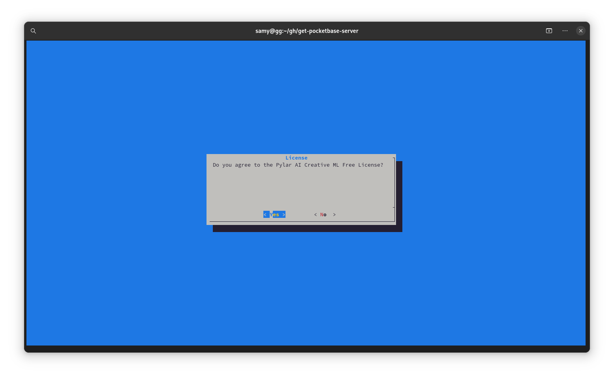
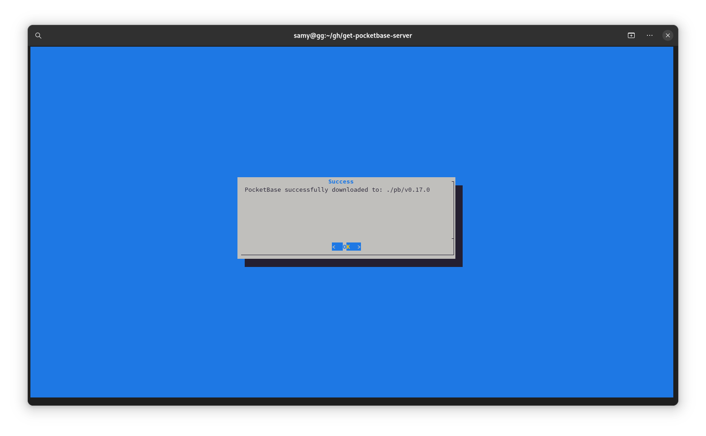

# Get Pocketbase Server

Just get the latest version of your favourite database system!

First run

```bash
chmod +x app.sh && ./app.sh
```

## Screen 1, License


## Screen 2, Pocketbase Version Manager


## Screen 3, Pocketbase Downloading


## Screen 3, Pocketbase Unzipping


# Screen 4, Success!


# License
Read the Pylar AI Creative ML Free License before use or anything else. Read on the Official HuggingFace source [Pylar AI Creative ML Free License](https://huggingface.co/spaces/superdatas/free-license) or the [LICENSE](License.md) file.
